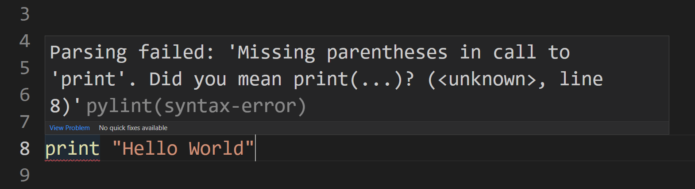
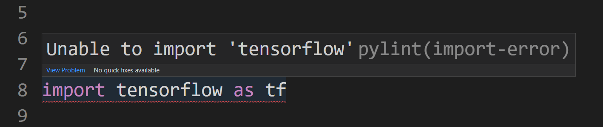
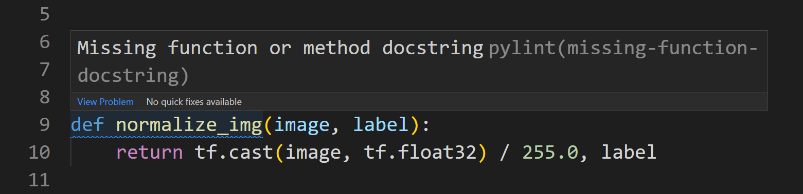
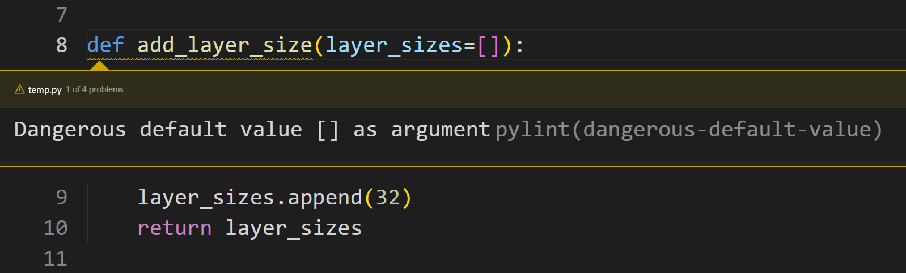
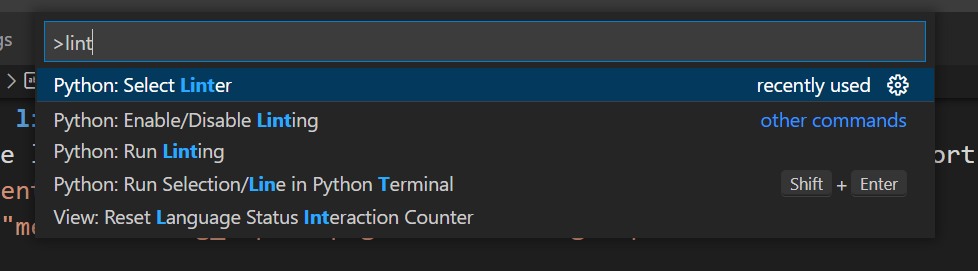
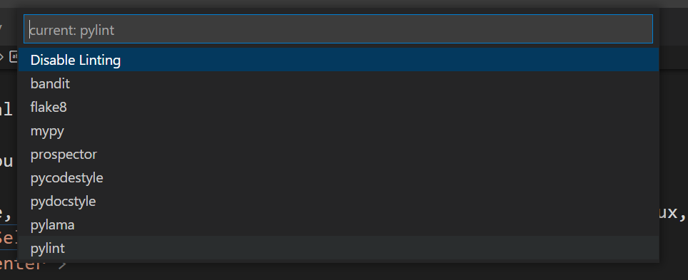
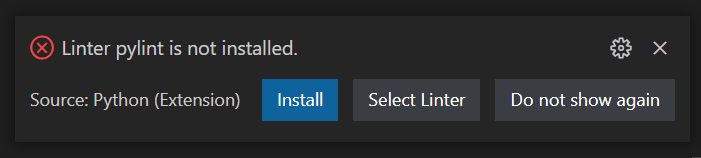
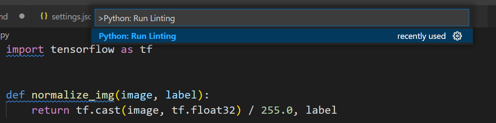
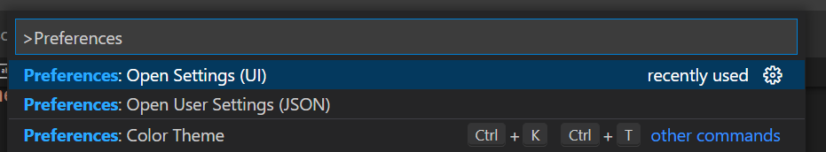
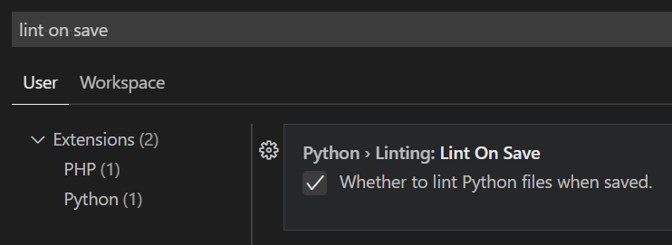

# **Linter**

A linter is a static code analysis tool (analyses the code without running it) that highlights errors, code malpractices and potential problems in your code.

<p align="center">
  
</p>

## **Table of Contents**
- [**Linter**](#linter)
  - [**Table of Contents**](#table-of-contents)
  - [**Why use a linter?**](#why-use-a-linter)
  - [**Installation**](#installation)
    - [**VSCode**](#vscode)
    - [**Pycharm**](#pycharm)
  - [**Configuration (optional)**](#configuration-optional)

## **Why use a linter?**

A linter is an easy way to make sure your code is clean and up to standards before you push it.

Here are some example usecases of a linter:

+ **Missing library**
  + Here the linter warns you that the library that you are trying to import is not installed in your environment.
<p align="center">
  
</p>

+ **Missing docstring**
  + Here the linter warns you that this function is missing its documentation
<p align="center">
  
</p>

+ **Code malpractice**
  + the linter also warns you about dangerous code habits such as using mutable objects as default arguments
  + the following example is dangerous because calling the same function ```add_layer_size()``` twice will return two different outputs: ```[32]``` and then ```[32, 32]```
<p align="center">
  
</p>

## **Installation**

In this section I'll cover how to install a linter in both [*VSCode*](#vscode) and [*PyCharm*](#pycharm).

### **VSCode**

This tutorial will cover the installation and usage of pylint in VSCode.

Make sure you have VSCode and Python installed on your machine.

1. In VSCode, open the command palette (```Ctrl+Shift+P``` on Windows/Linux, ```Cmd+Shift+P``` on Mac) and type ```Python: Select Linter``` and click on it
<p align="center">
  
</p>

2. In the dropdown menu, select ```pylint```
<p align="center">
  
</p>

3. VSCode will prompt you to install pylint to your Python environment. Click ```Install``` and wait for pylint to be installed
<p align="center">
  
</p>

4. Once installed, you can run the linter on your file by opening the command palette (```Ctrl+Shift+P``` on Windows/Linux, ```Cmd+Shift+P``` on Mac) and selecting ```Python: Run Linting```
<p align="center">
  
</p>

5. To make linting easier, you can configure VSCode to run the linter automatically when you save your file. To do so, open the command palette (```Ctrl+Shift+P``` on Windows/Linux, ```Cmd+Shift+P``` on Mac) and select ```Preferences: Open Settings (UI)```
<p align="center">
  
</p>

6. A settings window opens, in the search bar type ```Lint On Save``` and check the box associated to ```Whether to lint Python files when saved```
<p align="center">
  
</p>

7. Congratulations, you have successfully installed pylint in VSCode! Everytime you save a Python file, pylint will highlight the code malpractices it found.
<p align="center">
  
</p>

### **Pycharm**

This tutorial will cover the installation and usage of Pycharm's built-in linter.

... to be continued

## **Configuration (optional)**

Linters have other useful features such as rating your code standards and customizing the warnings. In this section we will cover these features for Pylint in VSCode:

... to be continued

