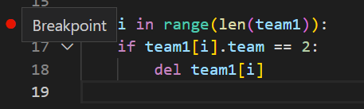
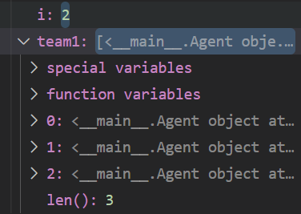

# **Debugger**

A debugger is a program that describes the state of your variables at chosen execution steps of your code. This helps better understand what your code is doing and makes debugging easier.

<p align="center">
  
</p>

# **Why use a debugger?**

A debugger explicitely describes the state of your variables at chosen execution steps of your code. This allows you to better understand what your code is doing and helps you find the exact origin of bugs. In general, using a debugger is more efficient and fast than using prints.

<p align="center">
  
</p>

# **Usage**

In this section we will use a simple example to show how to use the debugger both in [**VSCode**](#in-vscode) and [**Pycharm**](#in-pycharm) and show why it is useful.

I have written a short script that creates an agent class with a team attribute that can be ```1``` or ```2``` and I have created four agents with different teams.
  
```python
# Initialize an agent class with a team attribute
class Agent(object):
    def __init__(self, team):
        self.team = team
```

I have also written this obviously buggy script to isolate the agents of team ```1``` into a list called ```team1```:

```python
# Isolate the agents of team 1 in a list called team1
team1 = [agent1, agent2, agent3, agent4]

for i in range(len(team1)):
    if team1[i].team == 2:
        del team1[i]
```

Running this script will return the following error:
```
  if team1[i].team == 2:
IndexError: list index out of range
```

In this example the mistake is obvious: we are deleting items from the list we are iterating on, at some point the script will try to reach an element that has been deleted.

But let's imagine that the code is part of a way more complex project. This error prompt does not tell us exactly where the error is and we are going to use the debugger to find it.

## **In VSCode**

1. Add breakpoints: breakpoints are the parts of the code where you want the debugger to stop the execution and tell you the state of the variables at that moment. You can add a breakpoint by clicking on the red circle next to the line you want to break on.
<p align="center">
  
</p>

2. Start the debugger: in the topbar, select: ```Run``` -> ```Start Debugging```
<p align="center">
  
</p>

3. In debugging mode, a top bar will appear allowing you to advance to the next breakpoint by pressing on this button ```Continue (F5)```
<p align="center">
  
</p>

4. The state of variables at the breakpoint will be displayed on the left side of the screen with every variable and every class with detailed information about their types and attributes.
<p align="center">
  
</p>

5. Using the debugger, we see that after the step where ```i = 2```, ```agent2``` was not of team 1 and has been deleted from the list ```team1```, we see that ```team1``` has now a length of ```3``` instead of ```4```.
<p align="center">
  
</p>

6. Once we reach ```i = 3```, we are trying to reach the fourth element of the list ```team1``` which does not exist. This prompts an out of range error.
<p align="center">
  
</p>

## **In Pycharm**

to be continued...