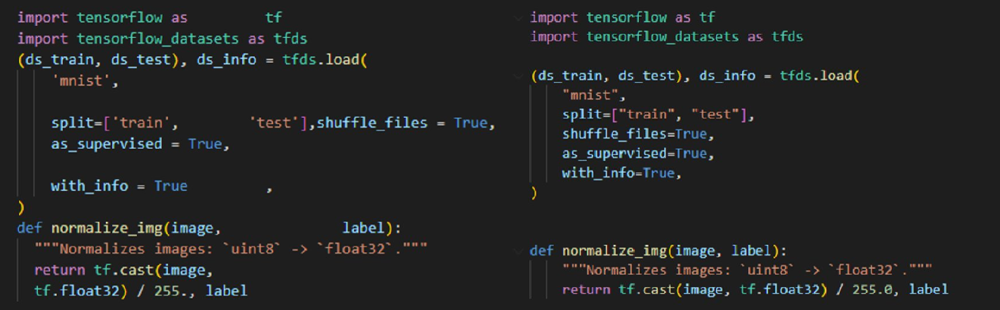
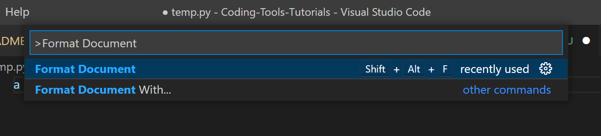

# **Formatter**

A Formatter formats your code to respect a specific standard. This makes your code more readable and easier to maintain.

<p align="center">
  
</p>

## **Why use a formatter?**

By formatting your code to respect a certain style standard, the formatter makes your project easier to read. If multiple collaborators are working on the same project, the formatter makes sure that every part of the code is shaped the same way regardless of the author, thus making the code more consistent and maintainable.

## **Installation**

In this section I'll cover how to install a formatter in both [*VSCode*](#vscode) and [*PyCharm*](#pycharm).

### **VSCode**

This tutorial will cover the installation and usage of Black in VSCode.

*Many formatters are available for VSCode, we tested some of them and found that Black felt better. It really made formatting something we never had to worry about when doing code reviews.*

Make sure you have VSCode and Python installed on your machine.

1. In VSCode, open the Extensions menu on the left sidebar
<p align="center">
  
</p>

2. In the search bar, type ```Black Formatter``` and install the extension
<p align="center">
  
</p>

3. Once installed, you now need to set Black as your default formatter. To do so, open the command palette (```Ctrl+Shift+P``` on Windows/Linux, ```Cmd+Shift+P``` on Mac) and select ```Preferences: Open Settings (UI)```
<p align="center">
  
</p>

4. In the search bar, type ```python formatting provider``` and select ```black``` as your provider
<p align="center">
  
</p>

5. While we are here: to make formatting easier, you can configure VSCode to run black automatically when you save your file. Search for ```format on save``` and check the box
<p align="center">
  
</p>

6. Congratulations, you have successfully installed black in VSCode! Everytime you save a Python file, black will format it automatically.
<p align="center">
  
</p>

You can also run black manually by opening the command palette (```Ctrl+Shift+P``` on Windows/Linux, ```Cmd+Shift+P``` on Mac) and selecting ```Format Document```
<p align="center">
  
</p>

You can also install black in your python environment by typing in a terminal: ```pip install black```

### **Pycharm**

... to be continued

