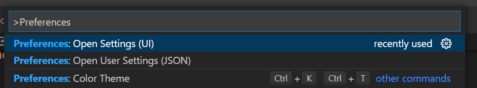

IMAGES AND VSCODE TUTORIAL

# **Formatter**

A Formatter formats your code to respect a specific standard. This makes your code more readable and easier to maintain.

<p align="center">
  
</p>

## **Why use a formatter?**

By formatting your code to respect a certain style standard, the formatter makes your project easier to read. If multiple collaborators are working on the same project, the formatter makes sure that every part of the code is shaped the same way regardless of the author, thus making the code more consistent and maintainable.

## **Installation**

In this section I'll cover how to install a formatter in both [*VSCode*](#vscode) and [*PyCharm*](#pycharm).

### **VSCode**

This tutorial will cover the installation and usage of Black in VSCode.

*Many formatters are available for VSCode, we tested some of them and found that Black felt better. It really made formatting something we never had to worry about when peer-reviewing.*

Make sure you have VSCode and Python installed on your machine.

1. In VSCode, open the command palette (```Ctrl+Shift+P``` on Windows/Linux, ```Cmd+Shift+P``` on Mac) and type ```Python: Select Linter``` and click on it
<p align="center">
  
</p>

2. In the dropdown menu, select ```pylint```
<p align="center">
  
</p>

3. VSCode will prompt you to install pylint to your Python environment. Click ```Install``` and wait for pylint to be installed
<p align="center">
  
</p>

4. Once installed, you can run the linter on your file by opening the command palette (```Ctrl+Shift+P``` on Windows/Linux, ```Cmd+Shift+P``` on Mac) and selecting ```Python: Run Linting```
<p align="center">
  
</p>

5. To make linting easier, you can configure VSCode to run the linter automatically when you save your file. To do so, open the command palette (```Ctrl+Shift+P``` on Windows/Linux, ```Cmd+Shift+P``` on Mac) and select ```Preferences: Open Settings (UI)```
<p align="center">
  
</p>

6. A settings window opens, in the search bar type ```Lint On Save``` and check the box associated to ```Whether to lint Python files when saved```
<p align="center">
  
</p>

7. Congratulations, you have successfully installed pylint in VSCode! Everytime you save a Python file, pylint will highlight the code malpractices it found.
<p align="center">
  
</p>

### **Pycharm**

... to be continued

