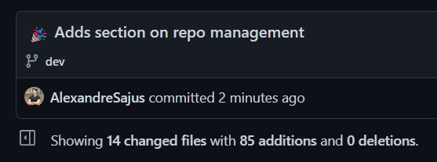
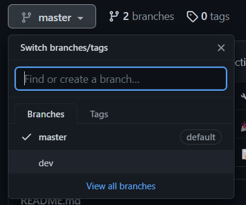
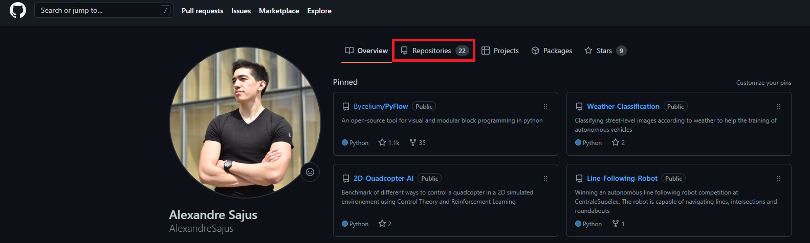
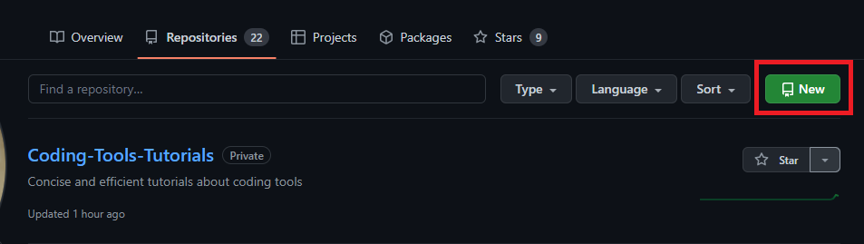
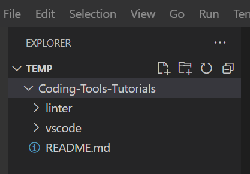
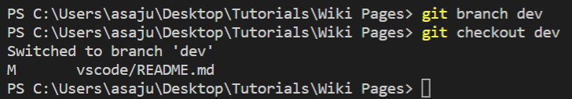
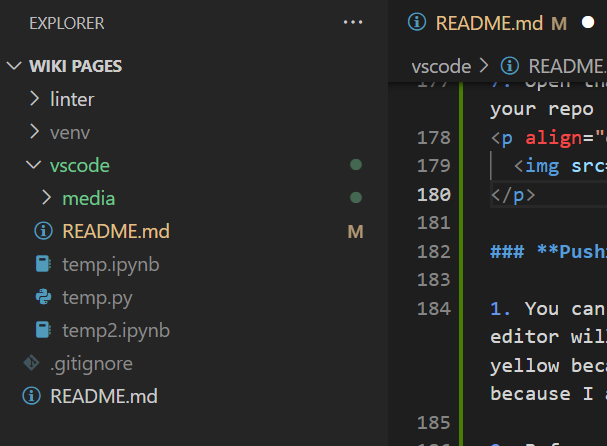
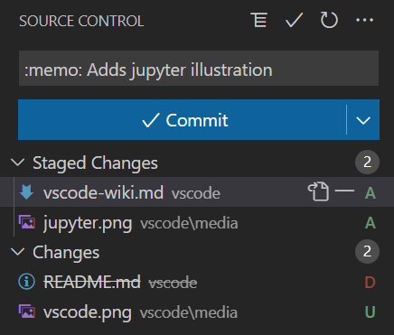

# Version Control

Version Control is a critical tool when it comes to writing quality code especially when working as a team. It allows you to track and revert changes to your code and make sure that your new code does not break other features of your project.

<p align="center">
  
</p>


The most commonly used version control tool is [**Git**](https://git-scm.com/).

Once installed, you can used git inside your terminal using commands that start with `git`

However, as there are a lot of commands to remember, it is recommended to use a graphical user interface (GUI) to interact with git to make your work easier.

In this tutorial we will work with the integrated Git GUIs of VSCode and Pycharm

## Best Practices

In this section we will describe the steps to create and manage a repo using git:

1. Create a Repo
2. Clone the Repo locally
3. Create a new Branch and Checkout to it
4. Create and edit files locally
5. Stage, Commit, Push
6. Create a Pull Request then Merge

We will first cover some basic vocabulary then describe every step one by one.

## Commits
A commit is a group of modifications. This includes adding a line to a file, renaming a file, deleting a file, etc. Every version of your project is a represented by an ordered list of commits that represent the modifications needed to go from an empty folder to your full project.
<p align="center">
  
</p>

## Branches
Branches are movable pointers that point to a specific commit. Because commits have hard-to-remember hexadecimal names, branches are a way to give an easy to remember name to a specific commit.
<p align="center">
  
</p>


## Creating a Repository
A repository stores your files and keeps track of the changes you make to it. You can create a repo from the UI of whichever version control tool you are using. Here we'll use github:

To create a repository:
1. Go to your Github profile page and press the repositories button:
<p align="center">
  
</p>
<p align="center">
  
</p>


2. Configure your new repo

- Write a name and description to concisely describe your project
- Choose the visibility of the repo:
  - Public: people will be able to see your repo but won't be able to make changes unless you allow them to
  - Private: people won't be able to see or edit your repo unless you authorize them to
- Choose if you want a:
  - <a href="...">`README.md`, a markdown file</a> that you can edit to precisely describe your project with text, badges, images, gifs... It should cover introduction, usage, how to contribute...
<p align="center">
  
</p>

  - <a href="...">`.gitignore`</a>, a text file that will contain the names of what you want your version control to ignore: temp files, environments...
  - `LICENSE`, <a href="...">the license</a> decides what other people can legally do with what you write
- Once you're done, press ```Create Repository``` and you are done:
<p align="center">
  
</p>

## Cloning the repository
Cloning a repo means copying its files locally so you can edit them on your machine.

This process is described in the following wiki pages under Managing a repo / Importing your repo:
<a href="...">in VSCode</a> or
<a href="...">in Pycharm</a>

Once done, your editor should show your repo in the file tree ready to be edited
<p align="center">
  
</p>

## Create a new branch
In general, your project should have a "main" or "master" branch that represents the latest stable version of your project.

When you want to edit your project, you should always edit it on a new separate branch to make sure that new code does not compromise the master branch.

You can create a branch using the terminal of your editor with ```git branch [branch name]```
<p align="center">
  
</p>

You now need to tell git that you want to work on this new branch by typing in the terminal ```git checkout [branch name]```
<p align="center">
  
</p>

## Editing your files locally

You can now edit your files locally from your editor. In VSCode, edits will be color-coded according to their state (modified, added, deleted...)
<p align="center">
  
</p>

## Stage, Commit and Push
When you are ready to upload the code to the repo's branch, you will need to stage, commit and push your changes:
- **Staging** is the process of choosing which changes you want to add to your commit
- **Committing** is grouping these changes into a single named entity
- **Pushing** is uploading the commit
<p align="center">
  
</p>
This process is described in the following wiki pages under Managing a repo / Pushing your changes,
<a href="..." target="_blank">in VSCode</a> or
<a href="..." target="_blank">in Pycharm</a>

## Create and merge a pull request
Your changes have now been uploaded to your branch, you can keep editing and pushing code to this branch.

If you want the edits you made to this branch to be in the ```master``` branch, you will need to create a pull request.

To illustrate this process, we will use the repo I use to write wiki pages as an example.

I have created a branch called ```git``` and I have committed and pushed the git tutorial I am currently writing on this branch
<p align="center">
  
</p>

When going to the github page of the repo, github proposes that I do a pull request
<p align="center">
  
</p>

To create a pull request, I can either press the ```compare & pull request``` button or go in the ```Pull requests``` tab and create it myself. I can then customize (comments, assign reviewers, label) and create the pull request:
<p align="center">
  
</p>

Once the pull request is created, I can then merge it on the pull request's page and the new code will be uploaded to the master branch.
<p align="center">
  
</p>
**BEFORE MERGING,** Make sure that your code is functional, up-to-standards and that it does not break other parts of the project. To ensure this,

- Make collaborators review your code
- Have proper <a href="...">testing for your code</a>
- Ideally you should have <a href="...">continuous integration</a> which will automatically test your code's function and standards on multiple OS' and versions of Python at each commit.
- You can also configure your repo so that merging is blocked unless it is approved by collaborators and tested

## Other considerations

### Merge conflicts
Git will try to do merges automatically, but sometimes it does not work. For example, when the source branch and the target branch both modify the same line.

In this case, Git will warn you that a "*Conflict*" occured and you will have to manually edit the corresponding files to chose the correct modification.
Afterwards, you can tell git that you resolved the conflict and Git will proceed by generating the Merge commit.

When you are resolving a conflict, you cannot do anything else like adding new commits, so be careful before merging that you are ready for the merge. If you were not ready, you can always cancel the merge.

### Remotes
Remotes are URLs that allow you to share your project with other people. While anybody can create and host a remote, most commonly, you will use [GitHub](https://github.com) (or [Gitlab](https://gitlab.com/explore)) to host and share your projects. 

Most projects only use one remote and every member of the project uses this remote for collaboration, but this is not required.

Remotes have names. By default, the main remote has the name "origin".

Remotes act as a copy of your project that is located on another computer. If changes are introduced in this distant project, you can use the `git pull` command (Or *Pull* button) to get the changes that occured on the branch you are currently working on. You can also use the `git push` command to send the commits you added to the branch you are to the distant computer.

For an existing project that is available in a remote, you can use the `git clone <remote-url>` command to get a copy of the project on your computer and start working on it.

Git is a decentralized version control system, which means that you can use it even when you are offline, but the `pull` and `push` commands won't work.

### Branches in remotes

To distinguish between a branch on your computer and a branch on the remote computer, you can check its name. Distant branch names start with the name of the remote. For example, you might have a "`main`" branch on your computer and a "`origin/main`" branch on the remote computer.

### Merges in remotes

If both you and the distant branch introduced commits on the same branch, git will (if possible) [merge](#Merges) the commits automatically. Because this can introduce conflicts, it is advised to that every person on a project works on a separate branch and merges only when there are done to avoid unexpected merge conflicts. 