# **VSCode**

VSCode is a code editor available for Windows, Mac, and Linux. It comes with a rich ecosystem of extensions for languages support, version control, code verification, formatting, auto-completion and more.

<p align="center">
  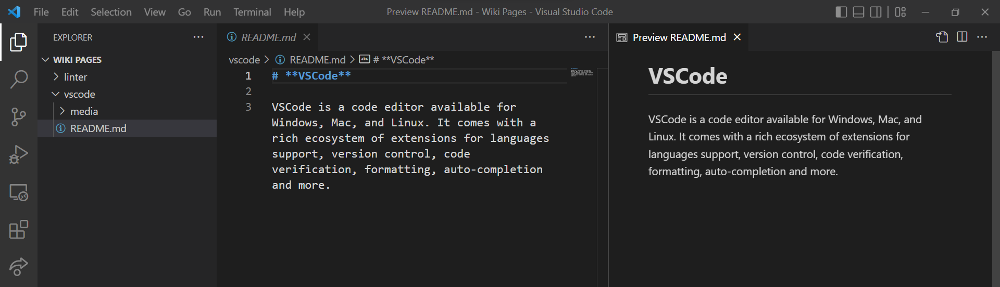
</p>

## **Table of contents**
- [**VSCode**](#vscode)
  - [**Table of contents**](#table-of-contents)
  - [**Why use VSCode?**](#why-use-vscode)
  - [**Installation**](#installation)
    - [**Windows**](#windows)
    - [**Linux**](#linux)
    - [**Mac**](#mac)
  - [**Useful extensions**](#useful-extensions)
  - [**Managing a repo from VSCode**](#managing-a-repo-from-vscode)
    - [**Importing your repo to VSCode:**](#importing-your-repo-to-vscode)
    - [**Pushing your changes***](#pushing-your-changes)
  - [**Using the debugger**](#using-the-debugger)

## **Why use VSCode?**

VSCode is an extremely user-friendly code editor. Its intuitive UI makes coding, version control and debugging easy. The extension marketplace allows users to install and use many tools for linting, formatting, collaboration and more.

Here are some example usecases of VSCode:

+ **Jupyter Support**
  + VSCode supports the edit and run of Jupyter notebooks, it has more features than other Jupyter editors since the extensions from the marketplace (linters, formatters, auto-completion) still function inside Jupyter notebooks.
  + Here is a Jupyter notebook creating and evaluating a model, Pylance (an extension) explains the "add" method of the "keras.models.Sequential" class.
<p align="center">
  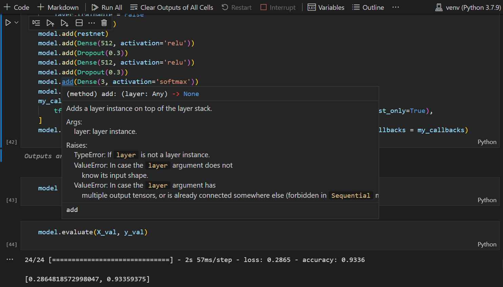
</p>

+ **Version Control**
  + VSCode has built-in support for Git, it allows you to commit, push, pull, merge branches... directly from the interface.
<p align="center">
  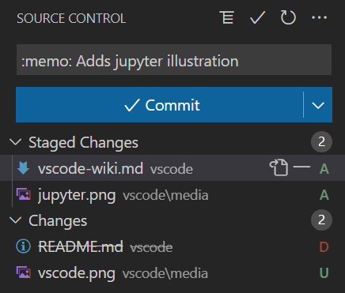
</p>

+ **LiveShare**
  + VSCode allows you to edit your code with other people in real-time, it's an efficient way to collaborate on a project.
<p align="center">
  
</p>

## **Installation**

This section will cover the basic installation of VSCode in [*Windows*](#windows), [*Linux*](#linux) and [*Mac*](#mac).

### **Windows**

1. Download the installer from the [VSCode website](https://code.visualstudio.com/download).
2. Launch the installer and follow the instructions.
3. Launch VSCode and follow the customization steps.

### **Linux**

... to be continued

### **Mac**

... to be continued

## **Useful extensions**

Installing extensions is done through the sidebar, click on the "Extensions" icon and search for the extension you want to install.

<p align="center">
  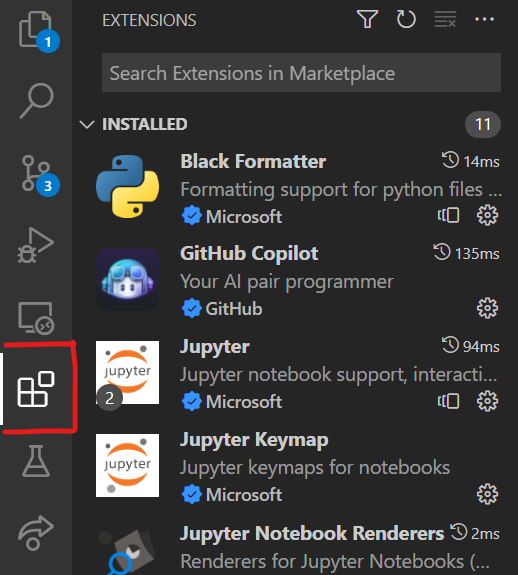
</p>

Here is a list of useful extensions

+ **Python**
  + This extension adds support for Python to VSCode, it allows you to run, lint and debug Python code. It also adds interface elements to manage Python environments.
  + The extension comes prepackaged with the Pylance and Jupyter extensions which are described below.
  + To use this extension, just create a python file and edit it in VSCode.
  + To choose the Python interpreter, open the command palette (```Ctrl+Shift+P``` on Windows/Linux, ```Cmd+Shift+P``` on Mac) and select ```Python: Select Interpreter```.	

<p align="center">
  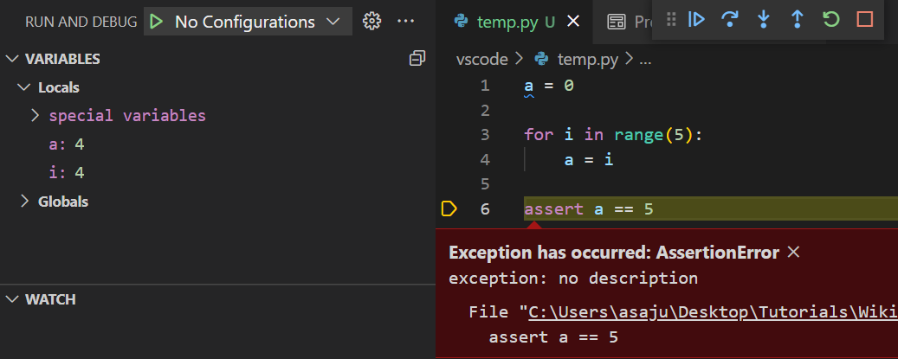
</p>

<p align="center">
  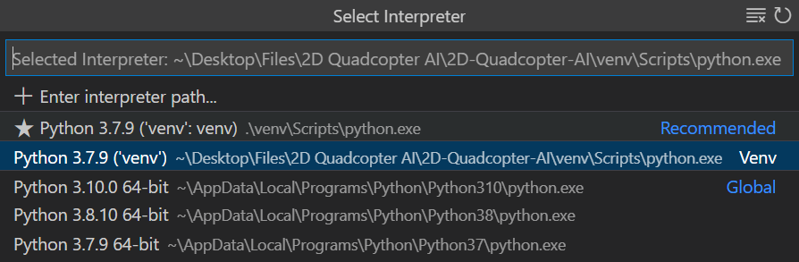
</p>

+ **Jupyter**
  + Adds support for Jupyter notebooks to VSCode, it allows the edit and run Jupyter notebooks.
  + To use this extension, just create a Jupyter notebook (.ipynb) and edit it in VSCode.

<p align="center">
  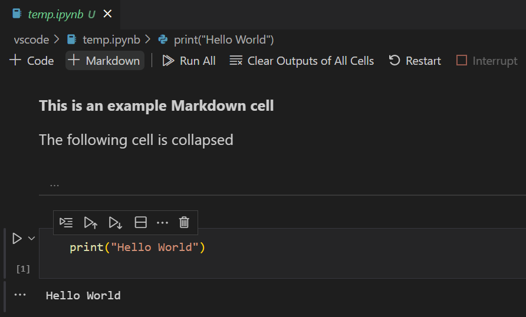
</p>

+ **Pylance**
  + This extension adds support for type checking and auto-completion to VSCode, it is a replacement for the Python extension's IntelliSense engine.
  + Pylance understands what type a variable has and uses this information to do completion, check for errors and provide documentation
  + Pylance is enabled automatically when you edit Python:
    + It will color code text according to type
    + Hover over a variable/function to see its type and documentation
    + ```Ctrl+Click``` or ```Cmd+Click``` on a variable/function to see its source code

<p align="center">
  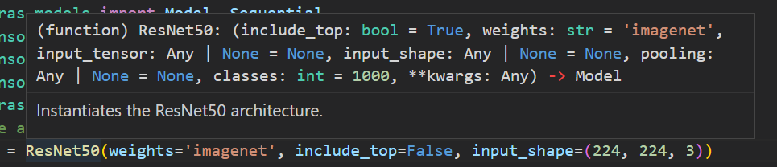
</p>

+ **Pylint**
  + This extension installs pylint in VSCode if it is not in your environment, it checks for errors and bad practices in your code.
  + To use this extension, just create a python file and edit it in VSCode, pylint will underline malpractices.
  + For more information (pylint configuration, linting on save): go to this wiki page (ADD LINK)

<p align="center">
  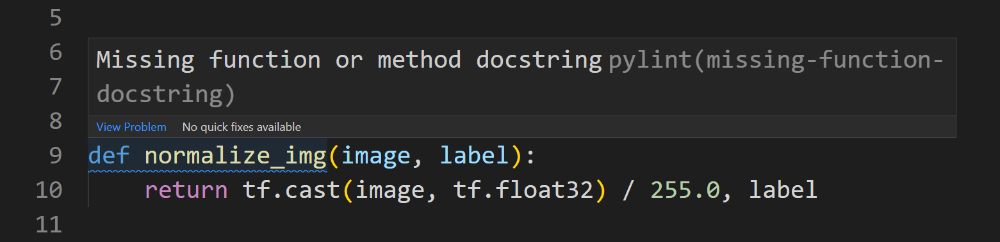
</p>

+ **Black Formatter**
  + This extension installs Black in VSCode if it is not in your environment, it automatically formats your code to follow a certain standard.
  + To use this extension, open the command palette (```Ctrl+Shift+P``` on Windows/Linux, ```Cmd+Shift+P``` on Mac) and select ```Format Document```.
  + For more information (black configuration, formatting on save): go to this wiki page (ADD LINK)
  + Before/After example:

<p align="center">
  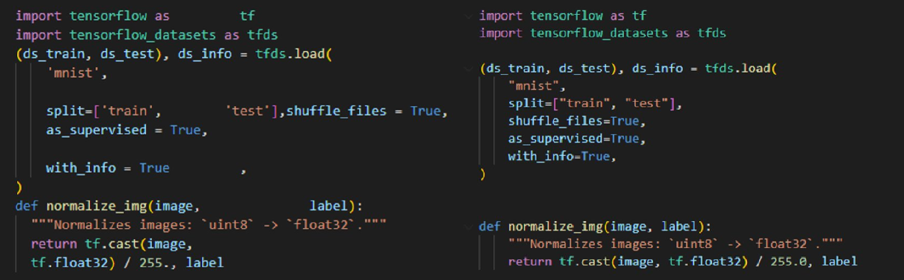
</p>

+ **Github Copilot** (paid and optional)
  + This extension is a paid subscription based service but its capabilities are well worth the price.
  + Copilot is a code completion tool based on OpenAI Codex and it is extremely powerful.
  + It reads and understands your codebase and often successfully writes docstrings, simple functions and classes.
  + For more information, visit this [*link*](https://github.com/features/copilot).
  + Here is an example output, I only typed the function name and variables, copilot's suggestion is written in grey:

<p align="center">
  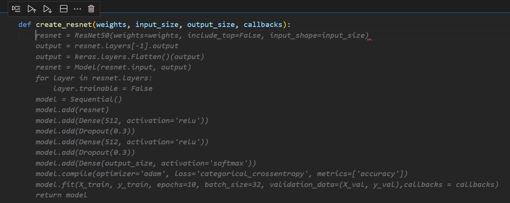
</p>

... to be continued (LINK THE RELEVANT WIKI PAGES, ADD EXTENSIONS)

## **Managing a repo from VSCode**

In this section we will cover how to manage a git repo from VSCode

### **Importing your repo to VSCode:**

1. Have a Git repository beforehand and [*Git*](https://git-scm.com/downloads) installed on your computer
<p align="center">
  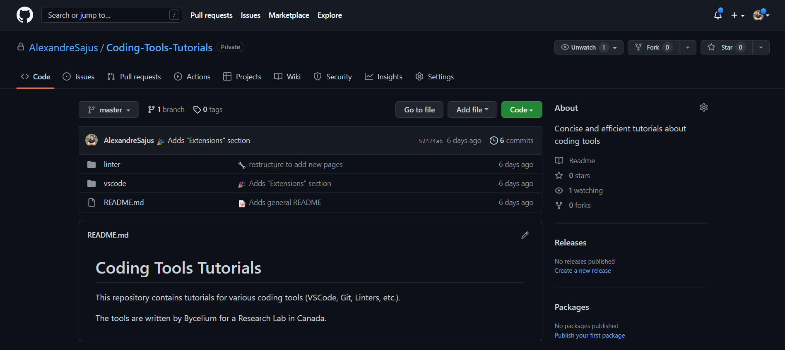
</p>

2. To edit it in VSCode, you are going to have to clone it on your machine. To do so, open a folder where you want to clone your project into using the top-bar: ```File``` -> ```Open Folder...```
<p align="center">
  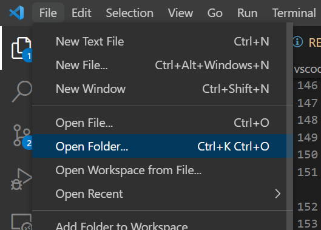
</p>

3. Also open a terminal from the top-bar: ```Terminal``` -> ```New Terminal```
<p align="center">
  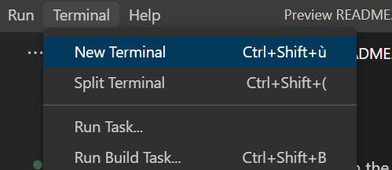
</p>

4. Find the link to your github repo, it should be on your github repo's webpage under Code -> Clone and should be an https link (for me its: https://github.com/AlexandreSajus/Coding-Tools-Tutorials.git)
<p align="center">
  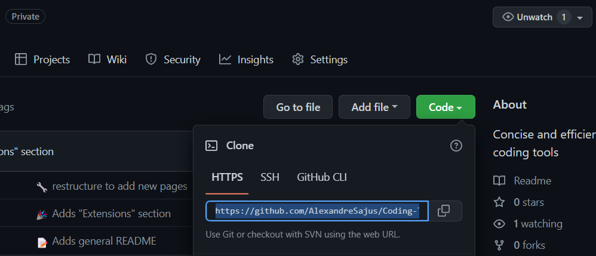
</p>

5. In your terminal, type: ```git clone [link to your repo]```
<p align="center">
  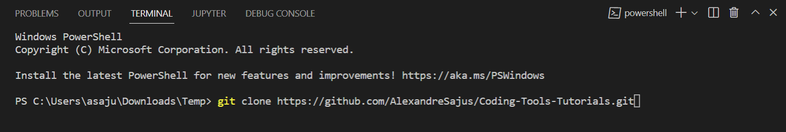
</p>

6. This should have downloaded the files of your repo in a folder that you can see in the filetree
<p align="center">
  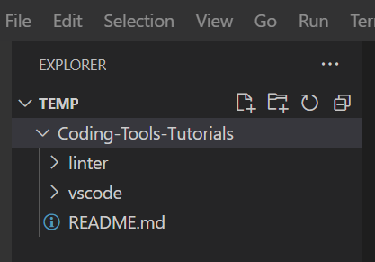
</p>

7. Open that folder in VSCode (top-bar: ```File``` -> ```Open Folder...```) and you are ready to edit your repo
<p align="center">
  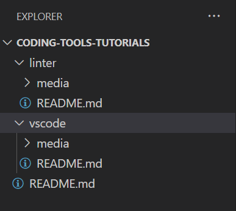
</p>

### **Pushing your changes***

1. You can now edit files like I have done when writing this tutorial, the file tree and the side of the editor will be color coded to explain if the changes are adds, edits or removals: here README.md is yellow because I edited it, media is green because I added images into it, the editor sidebar is green because I added text
<p align="center">
  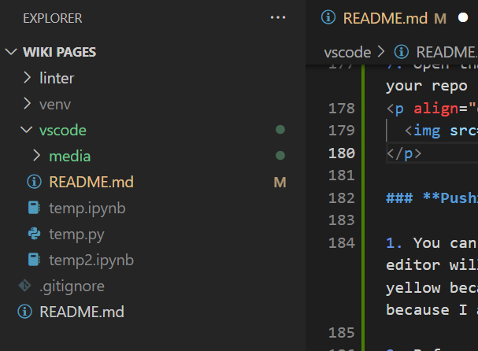
</p>

2. Before pushing your changes, I suggest changing branch. In general you should have a clean, functional master branch and you should always push edits to separate branches so that you can check them before merging them with master. You can create a branch with the terminal with ```git branch [branch name]```

3. You now need to tell git that you want to work on this new branch by typing in the terminal ```git checkout dev```
<p align="center">
  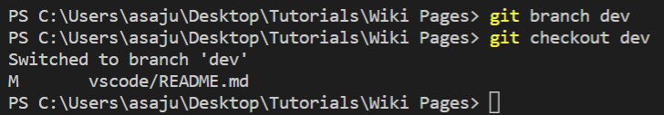
</p>

4. You can now commit your code using VSCode's git integration located on the sidebar called ```Source Control```:
<p align="center">
  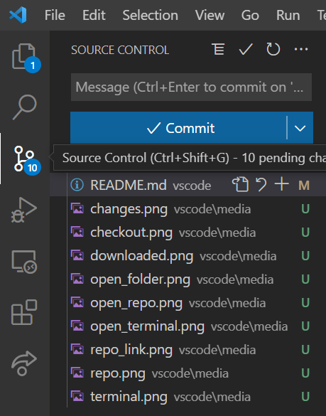
</p>

5. Stage the changes you want to commit using the ```+``` button next to the file
<p align="center">
  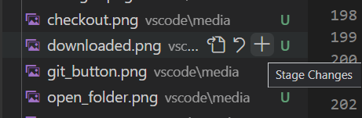
</p>

6. Type a commit message in the text box: the message should be concise and explain what the commit does, you can also use emojis to add color (ex: ```:tada: Adds section on repo management```)
<p align="center">
  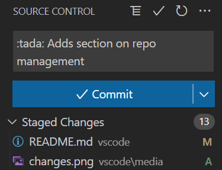
</p>

7. When you are ready to upload your changes, press the ```Commit & Push``` button
<p align="center">
  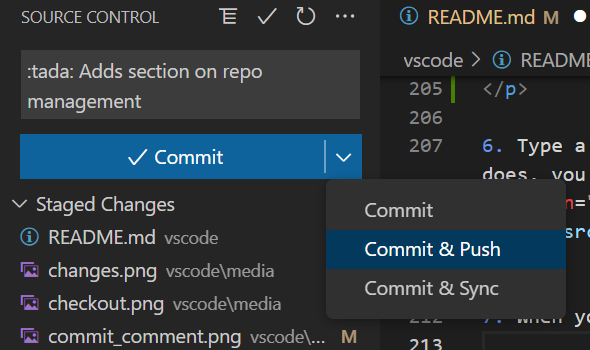
</p>

8. Your changes are now uploaded in your branch and you can call for a pull request if you want these changes to be added to master. Before accepting a pull request, make sure your code is functional and up-to-standard using code reviews, testing...


## **Using the debugger**

to be continued