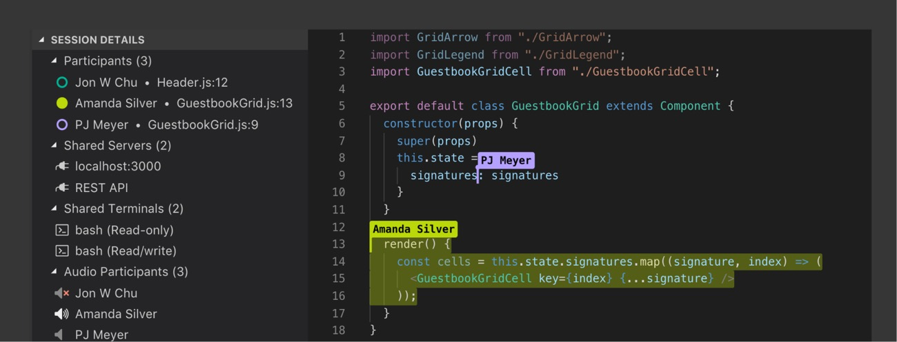

# **VSCode**

VSCode is a code editor available for Windows, Mac, and Linux. It comes with a rich ecosystem of extensions for languages support, version control, code verification, formatting, auto-completion and more.

  

## **Table of contents**
- [**VSCode**](#vscode)
  - [**Table of contents**](#table-of-contents)
  - [**Why use VSCode?**](#why-use-vscode)

## **Why use VSCode?**

VSCode is an extremely user-friendly code editor. Its intuitive UI makes coding, version control and debugging easy. The extension marketplace allows users to install and use many tools for linting, formatting, collaboration and more.

Here are some example usecases of VSCode:

+ **Jupyter Support**
  + VSCode supports the edit and run of Jupyter notebooks, it has more features than other Jupyter editors since the extensions from the marketplace (linters, formatters, auto-completion) still function inside Jupyter notebooks.
  + Here is a Jupyter notebook creating and evaluating a model, Pylance (an extension) explains the "add" method of the "keras.models.Sequential" class.

  

+ **Version Control**
  + VSCode has built-in support for Git, it allows you to commit, push, pull, merge branches... directly from the interface.

  

+ **LiveShare**
  + VSCode allows you to edit your code with other people in real-time, it's an efficient way to collaborate on a project.

  

